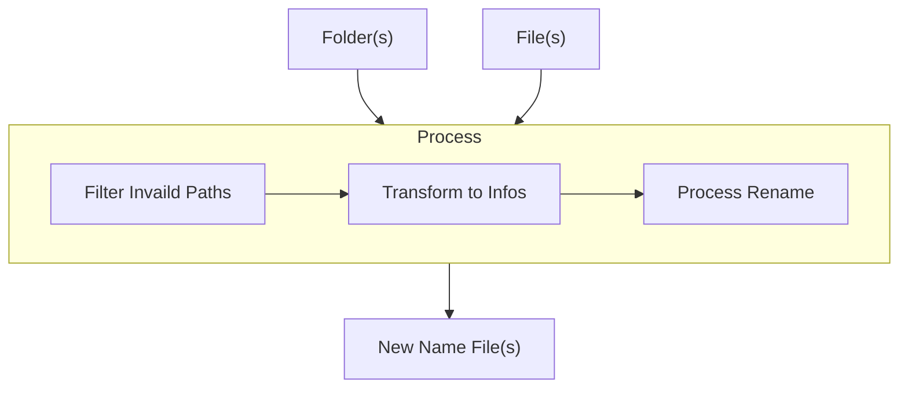

# RnJav

## Installation

```shell
npm i -g rnjav
```

## Execute

```shell
rnjav [folderPath]
```

or

```shell
npx rnjav [folderPath]
```

### Flow Process


```mermaid
graph TB;
  subgraph Process
    P1["Filter Invaild Paths"]
    P2["Transform to Infos"]
    P3["Process Rename"]

    P1 --> P2 --> P3
  end
  S1["Folder(s)"]
  S2["File(s)"]
  T1["New Name File(s)"]

  S1 --> Process
  S2 --> Process
  Process --> T1
```
